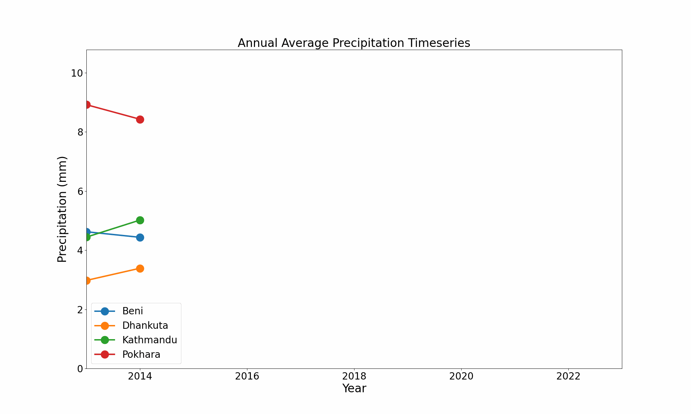

### Time series plotting for precipitation

Here we are downloading, cleaning and visualizing precipitation data for multiple places. From daily precipitation data, we calculate the annual precipitaion average for each location for each layer and show plot them against year.

Steps:
1. Use the `obtainData.js` script and interactively obtain CHIRPS daily precipitaion data. Mind the naming convention which is `placename_chirps.csv`. 
2. Use the `animation.py` to create a _gif_ of time series.